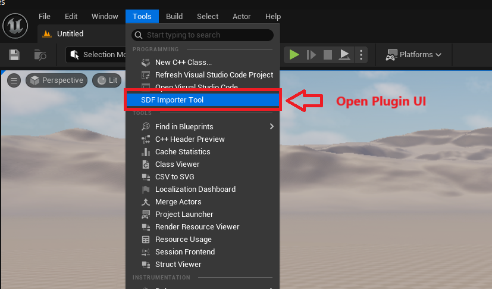
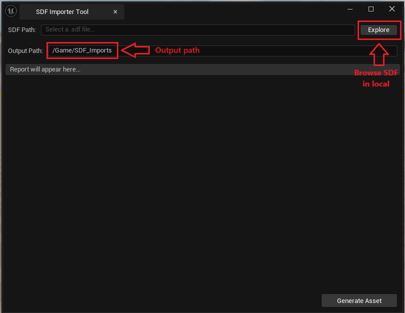
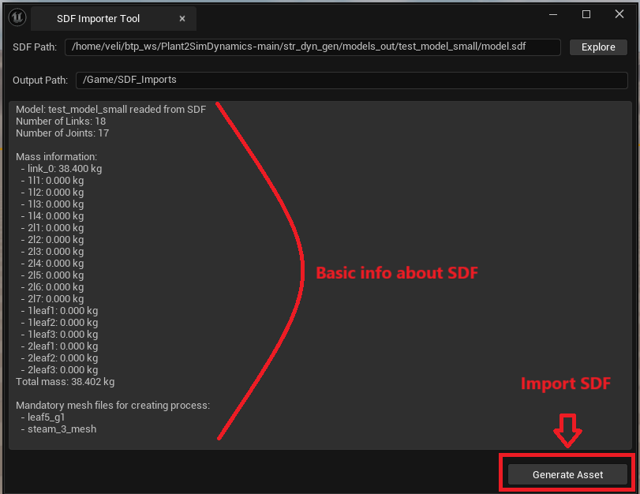
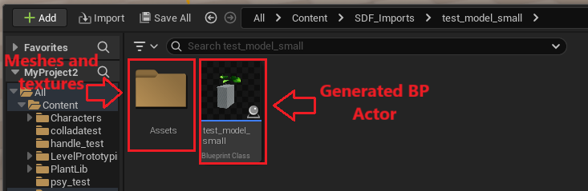

# Import_SDF – Unreal Engine 5 Plugin

> ## ⚠️ UNDER ACTIVE DEVELOPMENT ⚠️
> 
> **This plugin is in early development stage and NOT production-ready.**
> 
> - Many features are experimental or partially implemented
> - Only COLLADA (`.dae`) mesh format is currently supported
> - Physics constraints and joint behaviors may not work correctly
> - API and functionality are subject to change without notice
> - Extensive testing has not been performed
> 
> **Use at your own risk. Contributions and feedback are welcome!**

## What is SDFormat?

**SDFormat** (Simulation Description Format), sometimes abbreviated as SDF, is an XML format that describes objects and environments for robot simulators, visualization, and control. Originally developed as part of the Gazebo robot simulator, SDFormat was designed with scientific robot applications in mind and is widely used in robotics research and the ROS (Robot Operating System) ecosystem.

## Overview

This plugin enables import of SDFormat files (`.sdf`) from Gazebo into Unreal Engine 5. It converts COLLADA mesh files to FBX using Blender and creates Blueprint actors with basic physics setup.

## Current Features

- ✅ Basic SDF XML parsing (links, joints, visuals, inertial data)
- ✅ COLLADA (`.dae`) to FBX conversion via Blender
- ✅ Blueprint actor generation with mesh components
- ✅ Simple editor UI for file selection
- ✅ Basic coordinate system conversion (Gazebo → Unreal)

## Known Limitations

- ⚠️ **Only COLLADA (`.dae`) meshes supported** - FBX/STL/OBJ import not yet functional
- ⚠️ Primitive shapes (box, sphere, cylinder) may not work correctly
- ⚠️ Physics constraints are experimental and unreliable
- ⚠️ Joint limits and dynamics not properly implemented
- ⚠️ Material/texture import is incomplete
- ⚠️ No sensor or plugin support
- ⚠️ Tested only on Linux - Windows/Mac compatibility unknown

## Requirements

- **Unreal Engine**: 5.5.3 or later
- **Platform**: Linux (Ubuntu/Debian) - Windows/Mac untested
- **Blender**: 4.5.5 or later for COLLADA conversion
  - Must configure path in `Content/Python/sdf_tools/utils.py`
- **Plugins** (auto-enabled): PythonScriptPlugin, EditorScriptingUtilities

## Installation

1. Clone into your project's `Plugins` directory:
   ```bash
   cd YourProject/Plugins/
   git clone https://github.com/mvu20002/ImportSDF.git SDF_Import
   ```

2. Configure Blender path in `Content/Python/sdf_tools/utils.py`:
   ```python
   BLENDER_EXE = "/path/to/your/blender"
   ```

3. Open project in Unreal Editor and enable the plugin if prompted

4. Rebuild if requested

## Usage

1. **Open the tool**: Click "SDF Import" button in the Level Editor toolbar

   

2. **Select SDF file**: Click "Explore" and choose your `.sdf` file

   

3. **Review info**: Tool displays model information (links, mass, required meshes)

4. **Generate Asset**: Click "Generate Asset" to import

   

5. **Find assets**: Blueprint and meshes in `/Game/SDF_Imports/[ModelName]/`

   

## Troubleshooting

- **Python errors**: Enable PythonScriptPlugin in Plugin Manager
- **Blender errors**: Check path in `utils.py`, verify COLLADA file integrity
- **Meshes missing**: Ensure `.dae` files are accessible, check Output Log
- **Physics broken**: This is expected - physics system is not fully implemented

## Contributing

This is an early-stage project. Contributions, bug reports, and feedback are very welcome!

1. Fork the repository
2. Create a feature branch
3. Test your changes
4. Submit a pull request

## License

This project is licensed under the MIT License. See the `LICENSE` file for details.

## Credits

**Author**: mvu20002  
**Repository**: [github.com/mvu20002/ImportSDF](https://github.com/mvu20002/ImportSDF)

Built with SDFormat specification by Open Source Robotics Foundation.

---

*This is experimental software. Use at your own risk.*
